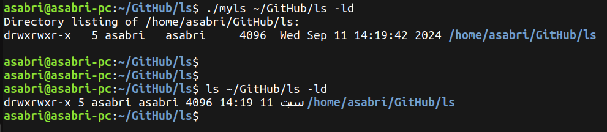
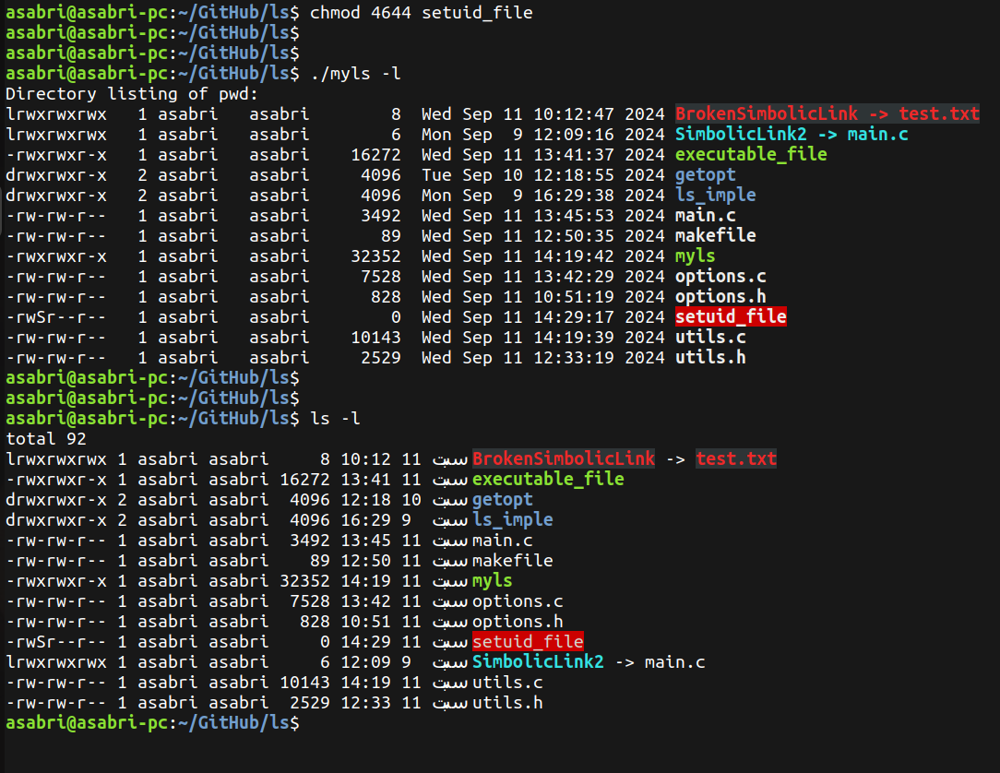

# `ls` Custom Implementation

In this repositpry, a custom implementation of the command `ls` is presented. This custom implementation supports colorful texts as well as the different options of `ls`

1. -l: print in long format
2. -a: show hidden files
3. -t: sort by modification time
4. -u: 

    `-ltu` show access time, sort by access time

    `-lu`  show access time, sort by name

    `-u`   sort by access time

5. -c:

    `-ltc` show change time, sort by change time

    `-lc`  show change time, sort by name

    `-c`   sort by change time

6. -i: show `inode number` at the beginning

7. -f: disable sorting, disable long format, and show hidden files

8. -d: show the passed directory only

9. -1: show one file in a row  

# Compilation and Execution

to compile the program, type:

```bash
make
```

to run the program, type:

```bash
./myls
```


# Output samples

### Basic `ls`


### `-l` option: ( Long format ) 


### `-a` option: ( show hidden files )


### `-t` option: ( sort by modification time )


### `-u` option: ( Access time )


### `-c` option: ( Change time )


### `-i` option: ( show inode number )


### `-f` option: ( Disable long format and sorting )


### `-d` option: ( show directory only )


### `-1` option: ( show 1 file in a row )


# Special permessions

### 1. Set UID: 

it allows the file to be executed with the permissions of the file's owner (rather than the user who is running the file).

### 2. Set GID: 

it allows the file to be executed with the group permissions of the file (rather than the user's group).

### 3. Sticky Bit: 

it ensures that only the file owner, the directory owner, or root can delete or rename files within that directory. It has no effect on files.

### setuid permession ( with execution permession ):

You will notice the letter `s` in lower case placed in the 3rd bit of the owner's permessions of the file `setuid_file` ( which is the location of the execusion permession bit ).


### setuid permession ( without execution permession ):
In this case, you will notice the letter `S` in upper case placed in the 3rd bit of the owner's permessions of the file `setuid_file`. This **indicates that the file has no execution permession.** 



### setgid permession ( with execution permession ):
You will notice the letter `s` in lower case placed in the 3rd bit of the group's permessions of the file `setgid_file` ( which is the location of the execusion permession bit )


### setgid permession ( without execution permession ):
In this case, you will notice the letter `S` in upper case placed in the 3rd bit of the group's permessions of the file `setgid_file`. This **indicate that the file has no execution permession.** 


### sticky bit ( with execution permession ):
You will notice the letter `t` in lower case placed in the 3rd bit of the other's permessions of the file `sticky_file`( which is the location of the execusion permession bit )


### sticky bit ( without execution permession ):
In this case, you will notice the letter `T` in upper case placed in the 3rd bit of the other's permessions of the file `sticky_file`. This **indicate that the file has no execution permession.** 

